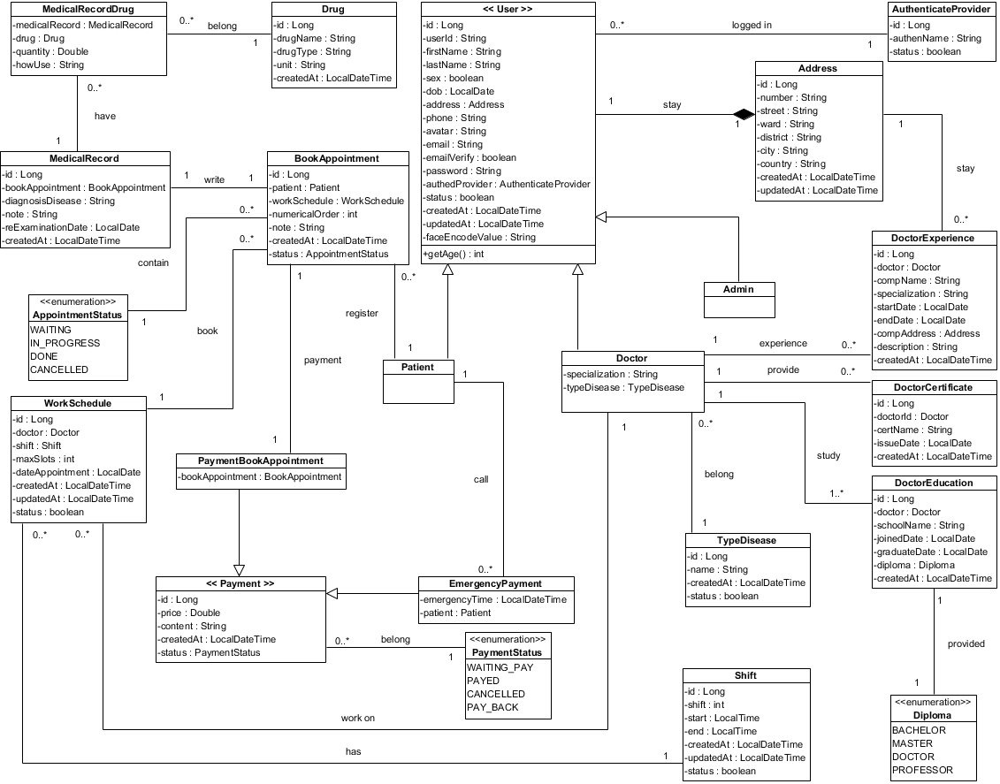

    
    <h1>SolarHealth</h1>
    <h3>💏 SolarHealth - Ứng dụng hỗ trợ chăm sóc sức khoẻ dành cho bệnh tâm lý 💑</h3>
	

		<a href="#giới-thiệu">📘 Giới Thiệu</a> -
		<a href="#công-nghệ-sử-dụng">📚 Công nghệ sử dụng</a> -
		<a href="#sơ-đồ-use-case">📑 Sơ đồ use-case</a> -
		<a href="#sơ-đồ-class">✏️ Sơ đồ class</a> -
		<a href="#sơ-đồ-database">📂 Sơ đồ database</a> -
		<a href="#kiến-trúc-phần-mềm">📐 Kiến trúc phần mềm</a> - 
		<a href="#màn-hình-kết-quả">📺 Màn hình kết quả</a> -
		<a href="#cách-cài-đặt">💻 Cách cài đặt và sử dụng</a> - 
		<a href="#thành-viên-thực-hiện">👪 Thành viên thực hiện</a>
	

## GIỚI THIỆU

Ứng dụng phần mềm <b>SolarHealth</b> là một ứng dụng cho phép mọi người có thể tư vấn, khám chữa bệnh từ xa mà không nhất thiết phải di chuyển. Việc sử dụng ứng dụng này
sẽ làm tối giản hoá việc đi lại cũng như công nghệ hoá hiện đại thay vì làm việc trực tiếp. Thay vì các bệnh nhân phải gặp trực tiếp bác sĩ, thì các bệnh nhân có thể làm việc với bác sĩ
từ xa với nhiều phương thức giao tiếp khác nhau (tin nhắn, cuộc gọi). 
 
😍 🌏 ❤️ 👫

Một số tính năng đặc trưng của ứng dụng:
1. Cho phép bệnh nhân có thể tư vấn khám sức khoẻ từ xa
2. Bác sĩ có thể biết được vị trí bệnh nhân để tới khám dựa vào thông tin cung cấp của bệnh nhân khi gọi cấp cứu
3. Bệnh nhân có thể gọi cấp cứu khi có trường hợp khẩn cấp  
...

## CÔNG NGHỆ SỬ DỤNG

	<ul>
		<li>Frontend: Website (ReactJS), Mobile (React-native)</li>
		<li>Backend: Java (Spring boot), Javascript (NodeJS), Python (Django)</li>
		<li>Database: MariaDB, MongoDB và Redis</li>
		<li>Security: Đăng nhập bằng form</li>
		<li>Deployment: Vercel (cho Web), Droplets (Digital Ocean - cho Backend)</li>
		<li>Kiến trúc: Microservices, Event-driven và Multi-layered</li>
		<li>Công nghệ khác: Spring OpenFeign, OpenCV (dùng CNN model), ARIMA Model, SES Model, Apache Kafka, Socket I/O, StompJS, S3 (lưu trữ ảnh)</li>
	</ul>

 

## SƠ ĐỒ USE CASE

## SƠ ĐỒ CLASS

## SƠ ĐỒ DATABASE

## KIẾN TRÚC PHẦN MỀM

## HIỆN THỰC

## CÁCH CÀI ĐẶT

## THÀNH VIÊN THỰC HIỆN
<table align="center">
	<tbody> 
		<tr align="center" valign="top">
			<td>
				<a href="https://github.com/TDMinhNhat">
					
					
Minh Nhật

				</a>
			</td>
			<td>
				<a href="https://github.com/DangQuang31122022">
					
					
Đăng Quang

				</a>
			</td>
		</tr>
	</tbody>
</table>
